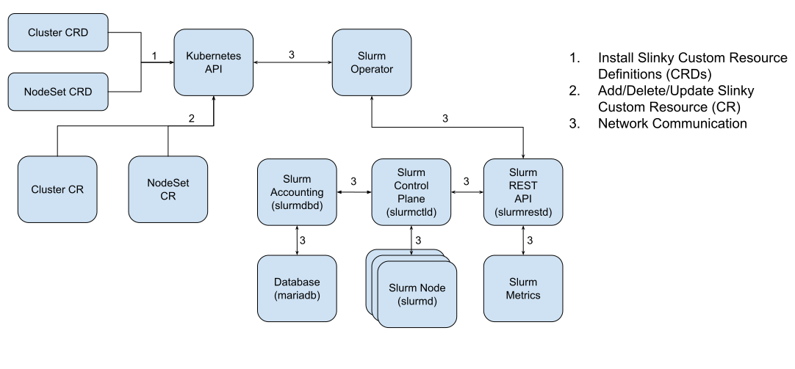

# Architecture

## Table of Contents

<!-- mdformat-toc start --slug=github --no-anchors --maxlevel=3 --minlevel=1 -->

- [Architecture](#architecture)
  - [Table of Contents](#table-of-contents)
  - [Overview](#overview)
  - [Big Picture](#big-picture)
  - [Directory Map](#directory-map)

<!-- mdformat-toc end -->

## Overview

This document describes the high-level architecture of the Slinky
`slurm-operator`.

## Big Picture

The `slurm-operator` follows the Kubernetes
[operator pattern][operator-pattern].

> Operators are software extensions to Kubernetes that make use of custom
> resources to manage applications and their components. Operators follow
> Kubernetes principles, notably the control loop.

The `slurm-operator` has one controller for each Custom Resource Definition
(CRD) that it is responsible to manage. Each controller has a control loop where
the state of the Custom Resource (CR) is reconciled.

Often, an operator is only concerned about data reported by the Kubernetes API.
In our case, we are also concerned about data reported by the Slurm API, which
influences how the `slurm-operator` reconciles certain CRs.

## Directory Map

This project follows the conventions of:

- [Golang][golang-layout]
- [operator-sdk]
- [Kubebuilder]

#### `api/`

Contains Custom Kubernetes API definitions. These become Custom Resource
Definitions (CRDs) and are installed into a Kubernetes cluster.

#### `cmd/`

Contains code to be compiled into binary commands.

#### `config/`

Contains yaml configuration files used for [kustomize] deployments.

#### `docs/`

Contains project documentation.

#### `hack/`

Contains files for development and Kubebuilder. This includes a kind.sh script
that can be used to create a kind cluster with all pre-requisites for local
testing.

#### `helm/`

Contains [helm] deployments, including the configuration files such as
values.yaml.

Helm is the recommended method to install this project into your Kubernetes
cluster.

#### `internal/`

Contains code that is used internally. This code is not externally importable.

#### `internal/controller/`

Contains the controllers.

Each controller is named after the Custom Resource Definition (CRD) it manages.
Currently, this consists of the nodeset and the cluster CRDs.

<!-- Links -->

[golang-layout]: https://go.dev/doc/modules/layout
[helm]: https://helm.sh/
[kubebuilder]: https://book.kubebuilder.io/
[kustomize]: https://kustomize.io/
[operator-pattern]: https://kubernetes.io/docs/concepts/extend-kubernetes/operator/
[operator-sdk]: https://sdk.operatorframework.io/
