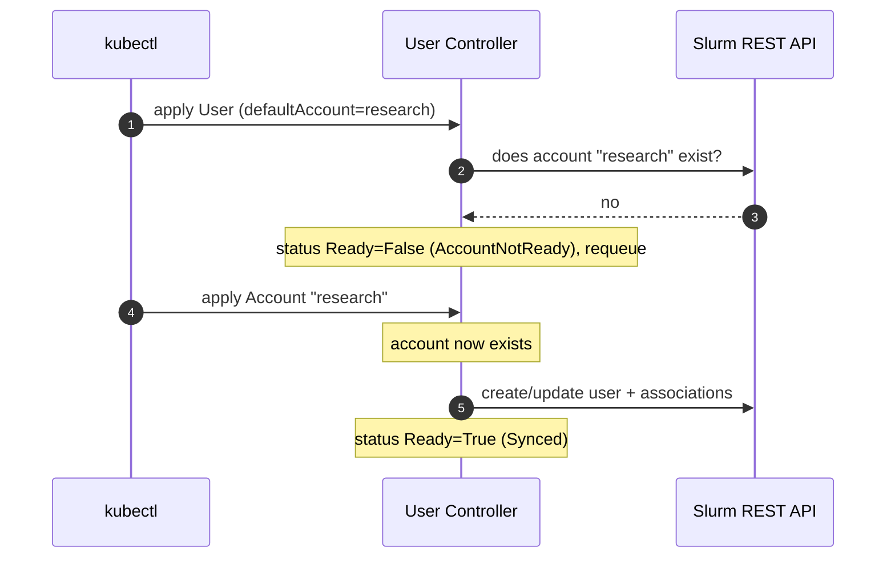

# Accounts and Users

This guide documents how to declaratively manage Slurm accounting entities —
`sacctmgr` accounts and users — from Kubernetes using the `Account` and `User`
custom resources. The operator translates these resources into `slurmdbd`
state through the Slurm REST API and continuously enforces them as the source
of truth.

## Table of Contents

<!-- mdformat-toc start --slug=github --no-anchors --maxlevel=6 --minlevel=1 -->

- [Accounts and Users](#accounts-and-users)
  - [Table of Contents](#table-of-contents)
  - [Prerequisites](#prerequisites)
  - [Creating an Account](#creating-an-account)
    - [Account Fields](#account-fields)
  - [Creating a User](#creating-a-user)
    - [User Fields](#user-fields)
    - [Account Dependency](#account-dependency)
  - [Association Limits](#association-limits)
  - [Checking Status](#checking-status)
  - [Events](#events)
  - [Deleting Accounts and Users](#deleting-accounts-and-users)
  - [Validation Rules](#validation-rules)

<!-- mdformat-toc end -->

## Prerequisites

- A running Slurm cluster managed by a `Controller` custom resource, with
  `slurmdbd` (accounting) enabled and reachable through `slurmrestd`.
- The slurm-operator and its CRDs installed (the `accounts.slinky.slurm.net`
  and `users.slinky.slurm.net` CRDs are part of the operator CRD chart).

Both resources reference their target cluster through `spec.controllerRef`,
which names the `Controller` resource for the Slurm cluster they belong to.
The reference is required and immutable.

## Creating an Account

An `Account` maps to a Slurm account (a `sacctmgr` account). Create one by
applying a manifest:

```yaml
apiVersion: slinky.slurm.net/v1beta1
kind: Account
metadata:
  name: research
  namespace: slurm
spec:
  controllerRef:
    name: slurm
  accountName: research
  description: Research team account
  organization: acme
  parentAccount: root
  deletionPolicy: Delete
  limits:
    qos:
      - normal
      - high
    defaultQos: normal
    grpTRES:
      cpu: "100"
      gres/gpu: "8"
    maxJobs: 50
```

```sh
kubectl apply -f account.yaml
```

Verify it was created and synced to Slurm:

```sh
kubectl -n slurm get accounts
# or using the short name
kubectl -n slurm get acct research
```

### Account Fields

| Field                 | Required | Default         | Description                                            |
| --------------------- | -------- | --------------- | ------------------------------------------------------ |
| `spec.controllerRef`  | yes      | —               | Name of the target `Controller` (immutable).           |
| `spec.accountName`    | no       | `metadata.name` | Account name in Slurm.                                  |
| `spec.description`    | no       | —               | Human-readable description.                             |
| `spec.organization`   | no       | —               | Organization the account belongs to.                   |
| `spec.parentAccount`  | no       | `root`          | Parent account, for building an account hierarchy.     |
| `spec.deletionPolicy` | no       | `Delete`        | `Delete` or `Orphan`; see [Deleting](#deleting-accounts-and-users). |
| `spec.limits`         | no       | —               | Association limits; see [Association Limits](#association-limits). |

## Creating a User

A `User` maps to a Slurm user and its account associations. A user must be a
member of at least one account.

```yaml
apiVersion: slinky.slurm.net/v1beta1
kind: User
metadata:
  name: alice
  namespace: slurm
spec:
  controllerRef:
    name: slurm
  userName: alice
  adminLevel: None
  defaultAccount: research
  deletionPolicy: Delete
  associations:
    - account: research
      limits:
        qos:
          - normal
        defaultQos: normal
        maxJobs: 10
    - account: research
      partition: debug
      limits:
        maxSubmitJobs: 5
```

```sh
kubectl apply -f user.yaml
kubectl -n slurm get users
# or using the short name
kubectl -n slurm get slurmuser alice
```

### User Fields

| Field                 | Required | Default         | Description                                                       |
| --------------------- | -------- | --------------- | ----------------------------------------------------------------- |
| `spec.controllerRef`  | yes      | —               | Name of the target `Controller` (immutable).                      |
| `spec.userName`       | no       | `metadata.name` | User name in Slurm.                                               |
| `spec.adminLevel`     | no       | `None`          | One of `None`, `Operator`, `Administrator`.                       |
| `spec.defaultAccount` | yes      | —               | Default account; must match one of `spec.associations[].account`. |
| `spec.associations`   | yes      | —               | Account memberships (at least one). Each pair of `account` + `partition` must be unique. |
| `spec.deletionPolicy` | no       | `Delete`        | `Delete` or `Orphan`; see [Deleting](#deleting-accounts-and-users). |

Each entry in `spec.associations` has:

| Field       | Required | Description                                                       |
| ----------- | -------- | ----------------------------------------------------------------- |
| `account`   | yes      | Account this user is associated with.                             |
| `partition` | no       | Scopes the association to a specific Slurm partition.             |
| `limits`    | no       | Per-association limits; see [Association Limits](#association-limits). |

### Account Dependency

The `User` controller will only apply a user once **all** the accounts it
references exist in Slurm. If a referenced account is not yet present, the user
is not applied; its `Ready` condition is set to `False` with reason
`AccountNotReady`, and reconciliation is retried periodically until the account
appears.



This makes ordering between `Account` and `User` resources unimportant — you
can apply them in any order and the operator converges once dependencies are
met.

## Association Limits

`spec.limits` (on an `Account`) and `spec.associations[].limits` (on a `User`)
share the same shape. All fields are optional; unset fields are not managed by
the operator.

| Field           | Type                | Description                                              |
| --------------- | ------------------- | -------------------------------------------------------- |
| `fairshare`     | string              | Integer number of shares, or the literal `parent`.       |
| `priority`      | integer             | Priority added to jobs using this association.           |
| `qos`           | list of strings     | QOS names allowed for this association.                  |
| `defaultQos`    | string              | Default QOS; must be present in `qos`.                   |
| `grpTRES`       | map[string]string   | Aggregate TRES limit, e.g. `{"cpu":"100","gres/gpu":"8"}`. |
| `grpJobs`       | integer             | Max running jobs for the group.                          |
| `grpSubmitJobs` | integer             | Max submitted jobs for the group.                        |
| `grpWall`       | duration            | Aggregate wall-clock limit for the group.                |
| `maxJobs`       | integer             | Max running jobs.                                        |
| `maxSubmitJobs` | integer             | Max submitted jobs.                                      |
| `maxTRESPerJob` | map[string]string   | Per-job TRES limit, e.g. `{"cpu":"4"}`.                  |
| `maxWallPerJob` | duration            | Per-job wall-clock limit, e.g. `"1h30m"`.                |

## Checking Status

Both resources report a `Ready` condition under `status.conditions`.

```sh
kubectl -n slurm get acct research -o jsonpath='{.status.conditions[?(@.type=="Ready")]}'
kubectl -n slurm get slurmuser alice -o jsonpath='{.status.conditions[?(@.type=="Ready")]}'
```

Common condition reasons:

| Reason            | Status | Meaning                                                          |
| ----------------- | ------ | ---------------------------------------------------------------- |
| `Synced`          | True   | The entity was successfully reconciled into Slurm.               |
| `SyncFailed`      | False  | The Slurm REST API call failed; see the condition message.       |
| `NoClient`        | False  | No Slurm client is available for the referenced `Controller`.    |
| `AccountNotReady` | False  | (User only) A referenced account does not yet exist in Slurm.    |

## Events

The controllers emit Kubernetes events to the resource on meaningful
transitions, so you can use `kubectl describe` to see what happened:

```sh
kubectl -n slurm describe acct research
kubectl -n slurm describe slurmuser alice
```

Event reasons include `Synced`, `SyncFailed`, `NoClient`, `AccountNotReady`
(user), and on deletion `Deleted`, `Orphaned`, or `DeleteFailed`. Events are
emitted on transitions rather than on every reconcile, to avoid noise.

## Deleting Accounts and Users

Deleting the Kubernetes resource triggers Slurm-side cleanup governed by
`spec.deletionPolicy`:

- `Delete` (default): the corresponding account or user is removed from Slurm.
- `Orphan`: the Kubernetes resource is removed but the Slurm entity is left in
  place.

```sh
kubectl -n slurm delete slurmuser alice
kubectl -n slurm delete acct research
```

A finalizer ensures the Slurm-side cleanup completes before the Kubernetes
resource is removed. If cleanup fails, the resource remains with a
`DeleteFailed` event and is retried.

> Note: deleting an `Account` that still has users associated with it may fail
> in Slurm. Remove or re-home dependent `User` resources first.

## Validation Rules

A validating webhook rejects invalid resources at admission time:

- `spec.controllerRef` is required and cannot be changed after creation.
- `limits.defaultQos`, when set, must also appear in `limits.qos`.
- For `User`:
  - `spec.associations` must contain at least one entry.
  - `spec.defaultAccount` must match one of the associations' `account`.
  - Each `account` + `partition` pair in `spec.associations` must be unique.
