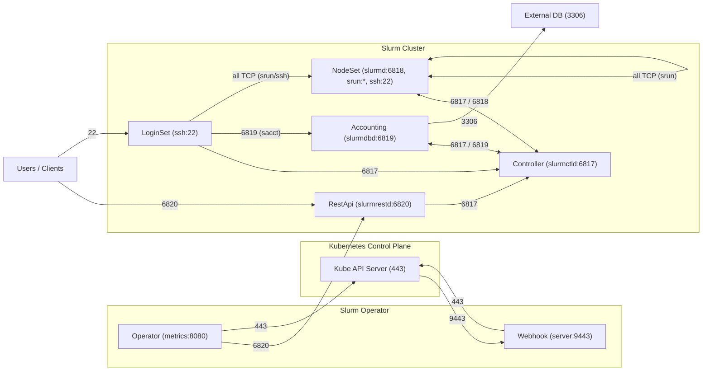

# Network Policies

## Table of Contents

<!-- mdformat-toc start --slug=github --no-anchors --maxlevel=6 --minlevel=1 -->

- [Network Policies](#network-policies)
  - [Table of Contents](#table-of-contents)
  - [Overview](#overview)
  - [Component Traffic Diagram](#component-traffic-diagram)
  - [Enabling Network Policies](#enabling-network-policies)
  - [Per-Component and Per-Instance Toggles](#per-component-and-per-instance-toggles)
  - [Extra Rules](#extra-rules)
  - [srun and Ephemeral Ports](#srun-and-ephemeral-ports)
  - [Caveats](#caveats)

<!-- mdformat-toc end -->

## Overview

Both the `slurm-operator` and `slurm` Helm charts can render opt-in Kubernetes
[NetworkPolicy] resources that isolate each Slurm component at the network
layer. Policies are **disabled by default** and are enabled through the
`networkPolicy.enabled` value in each chart.

When enabled, every component only accepts the ingress it needs and is only
allowed to reach the peers it must talk to (plus DNS). The diagram below
captures the intended communication boundaries between all components.

## Component Traffic Diagram



## Enabling Network Policies

Enable the policies per chart with the global toggle:

```sh
# slurm chart (controller, nodeset, accounting, restapi, loginset)
helm upgrade slurm oci://ghcr.io/slinkyproject/charts/slurm \
  --namespace slurm --set networkPolicy.enabled=true

# slurm-operator chart (operator, webhook)
helm upgrade slurm-operator oci://ghcr.io/slinkyproject/charts/slurm-operator \
  --namespace slinky --set networkPolicy.enabled=true
```

DNS resolution (UDP/TCP 53) is always permitted as egress so the components can
resolve in-cluster service names.

## Per-Component and Per-Instance Toggles

Once the global toggle is on, each component can be disabled individually:

- Singleton components (`controller`, `restapi`, `accounting`, `operator`,
  `webhook`) expose `<component>.networkPolicy.enabled`.
- Map components (`nodesets`, `loginsets`) expose a per-instance
  `networkPolicy.enabled` flag inside each map entry, defaulting to the value in
  `nodesetDefaults` / `loginsetDefaults`. One NetworkPolicy is generated per
  enabled instance, scoped via the `app.kubernetes.io/instance` label.

```yaml
networkPolicy:
  enabled: true
nodesets:
  gpu:
    networkPolicy:
      enabled: false # disable just this NodeSet's policy
```

## Extra Rules

Additional ingress/egress rules can be appended at three levels:

- Global: `networkPolicy.extraIngress` / `networkPolicy.extraEgress` (applied to
  every policy in the chart).
- Per-component: `<component>.networkPolicy.extraIngress` /
  `extraEgress`.
- Per-instance: inside each `nodesets` / `loginsets` map entry under
  `networkPolicy.extraIngress` / `extraEgress`.

```yaml
networkPolicy:
  enabled: true
  extraEgress:
    - to:
        - ipBlock:
            cidr: 10.0.0.0/8
      ports:
        - protocol: TCP
          port: 443
```

## srun and Ephemeral Ports

`srun` opens ephemeral ports for interactive job I/O. To keep these flows
working, the policies allow **all TCP** between `slurmd` <-> `slurmd` and from
`login` -> `slurmd`. In hardened environments, constrain this range with
[`SrunPortRange`] in `slurm.conf` and tighten the corresponding `extraIngress`
/ `extraEgress` rules accordingly.

## Caveats

- Policies use the `app.kubernetes.io/name` and `app.kubernetes.io/instance`
  labels applied by the operator; a CNI that enforces NetworkPolicy is required.
- Non-default ports (Slurm, ssh, mariadb) must be reflected in your values; the
  policies follow the ports configured for each component.
- The operator-to-`slurmrestd` egress uses an empty `namespaceSelector` to
  support deployments where the operator and Slurm cluster live in different
  namespaces.

<!-- links -->

[NetworkPolicy]: https://kubernetes.io/docs/concepts/services-networking/network-policies/
[`SrunPortRange`]: https://slurm.schedmd.com/slurm.conf.html#OPT_SrunPortRange
